<p align="center">
  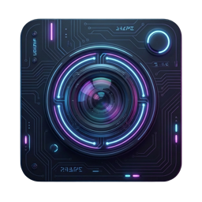
</p>
<h1 align="center">TDashcam Studio</h1>

<p align="center">English | <a href="README_CN.md">简体中文</a></p>

<p align="center">
  <a href="https://github.com/DeaglePC/TDashcamStudio/releases"></a>
  <a href="https://github.com/DeaglePC/TDashcamStudio/releases"></a>
  <a href="https://github.com/DeaglePC/TDashcamStudio/blob/main/LICENSE"></a>
  <a href="https://github.com/DeaglePC/TDashcamStudio/stargazers"></a>
  <a href="https://github.com/DeaglePC/TDashcamStudio/actions/workflows/build.yml"></a>
  <a href="https://app.tdashcam.studio/"></a>
</p>

A modern, browser-based viewer for your Tesla dashcam footage. Play all six camera angles (Front, Back, Left, Right, Left B-Pillar, Right B-Pillar) simultaneously with a sleek and intuitive interface. Now available as a **desktop application**!

## 🆚 Why choose TDashcam Studio?

Compared to the original Tesla Dashcam player, this project provides more powerful features and a superior experience:

| Feature | Tesla In-Car Player | Raw PC Playback | TDashcam Studio (This Project) |
| :--- | :--- | :--- | :--- |
| **Sync Playback** | ✅ Supports 6 channels | ❌ Manual file opening, no sync | ✅ **Perfect 6-channel sync, intuitive layout** |
| **Viewing Exp.** | Limited to car screen | Large screen, but messy file folders | **Multi-device**, large screen, organized events |
| **Filtering** | Basic categories only | ❌ Manual search in thousands of folders | ✅ **Smart filtering by date, time, and event type** |
| **Driving Data** | ✅ Supports metadata | ❌ Video only, no hidden data access | ✅ **Visual Dashboard: Speed, Pedals, AP, etc.** |
| **Video Editing** | ❌ Not supported | ❌ Requires pro tools (FFmpeg/Premiere) | ✅ **Visual drag-and-drop, exported videos include metadata watermarks** |
| **Easy Sharing** | ❌ Hard to share | ❌ Raw segments only, poor experience | ✅ **One-click Grid Export with time & driving info watermarks** |
| **Map/Location** | Basic map display | ❌ No location data | ✅ **Street names + Deep link to Google/Gaode** |
| **Privacy** | - | ✅ Local playback | ✅ **100% Local processing**, privacy first |


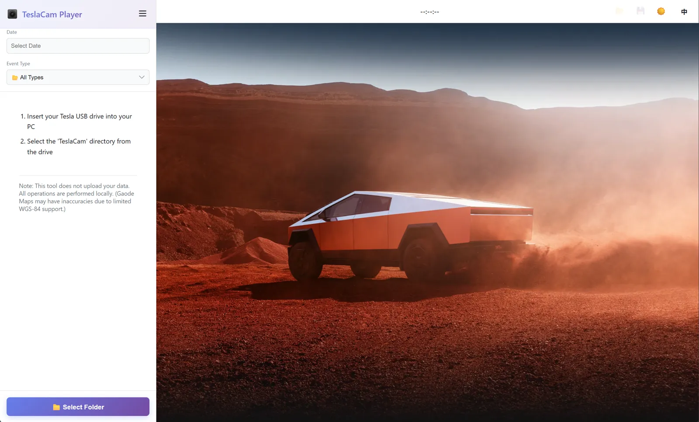

## 📺 Feature Showcase

| Feature | Demonstration |
| :--- | :--- |
| **Quick Start**: Support folder drag-and-drop, plug and play | 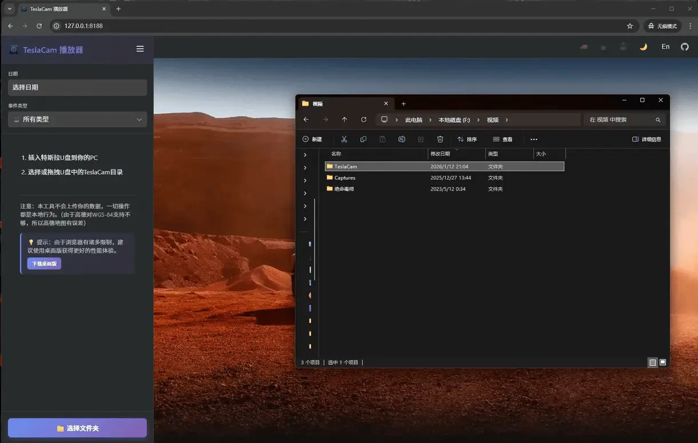 |
| **Modern UI**: Dark/Light mode support with smooth animations | 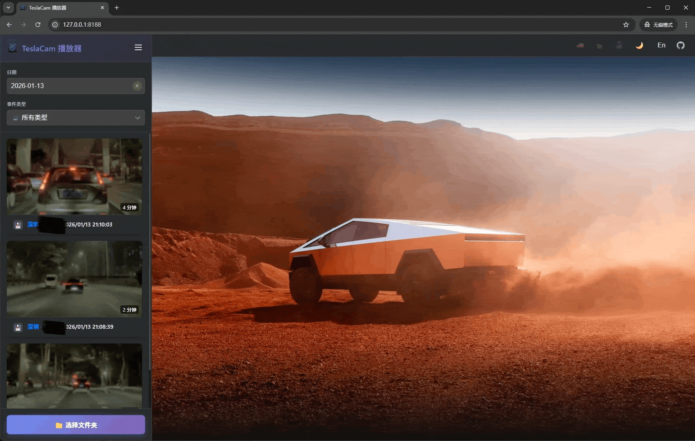 |
| **Smart Filtering**: Locate events by date and type quickly | 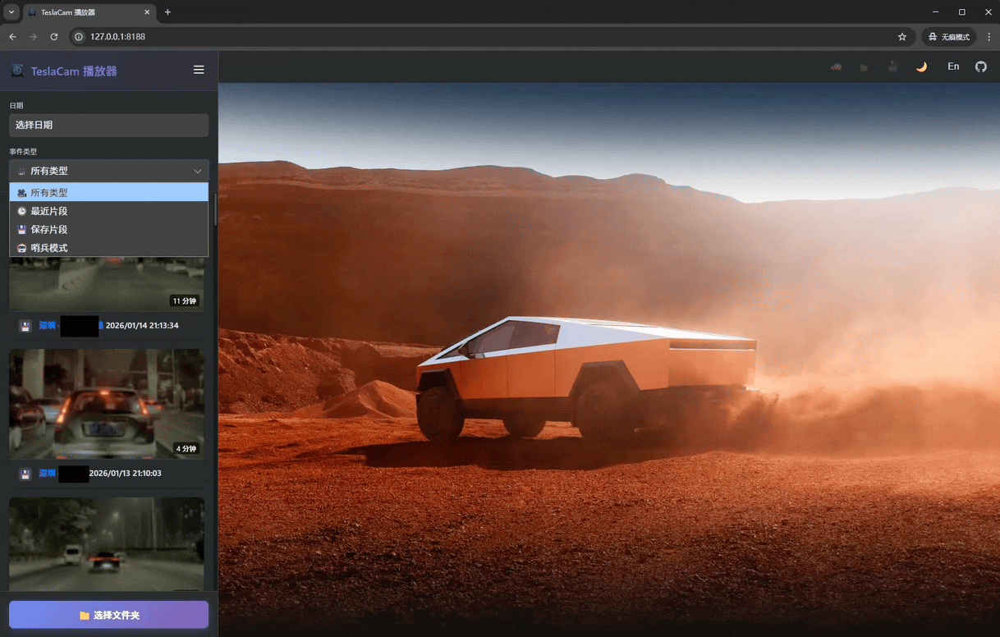 |
| **Map Integration**: Street names & deep links to maps | 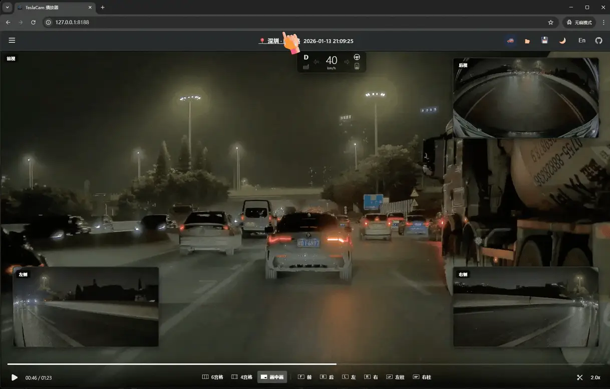 |
| **Playback Speed**: Flexible 0.5x - 2.0x speed control |  |
| **Driving Data**: Real-time display of speed, turn signals, accelerator depth, brake pedal, AP/FSD, steering angle, etc. | 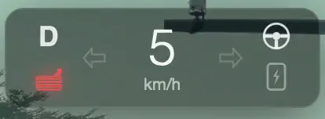 |
| **Speed Curve**: Real-time speed curve on progress bar for quick acceleration/braking identification | 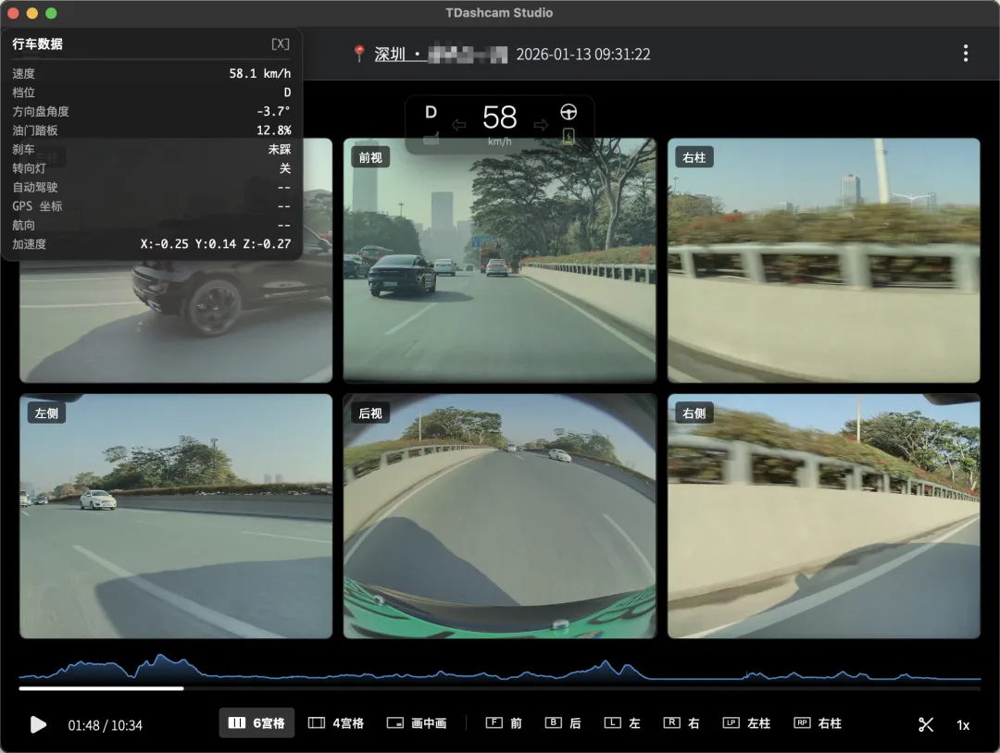 |
| **Data Export**: One-click export of driving metadata to CSV for data analysis | 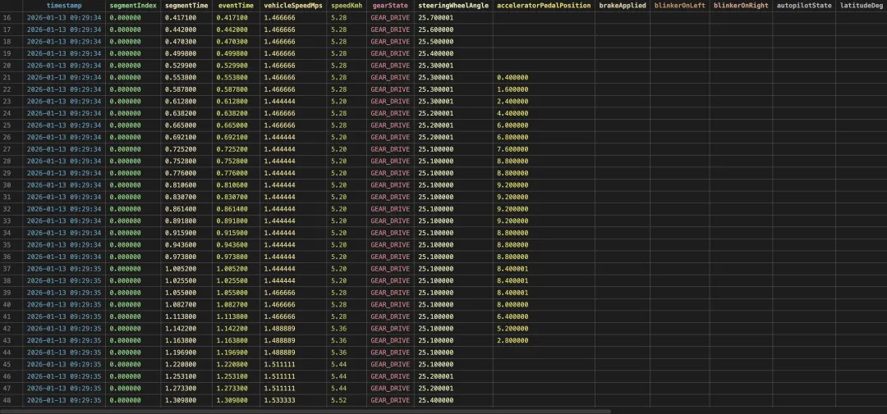 |
| **Sync Playback**: Perfectly synced footage with multiple layouts | 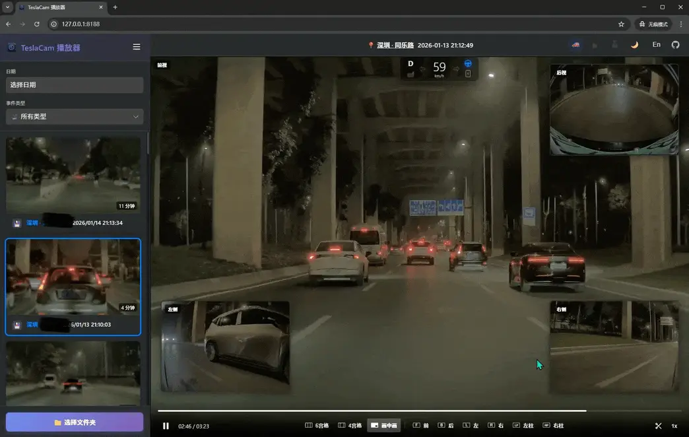 |
| **Visual Clipping**: Drag-and-drop handles for precise export | 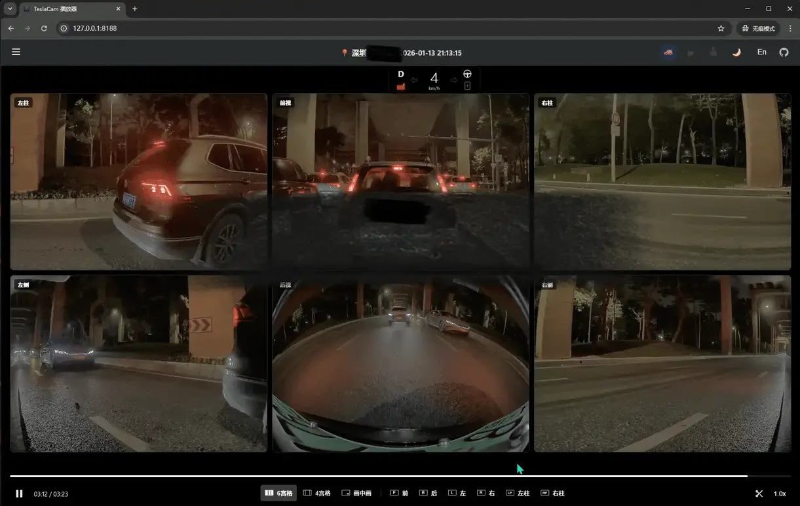 |
| **Export Results**: Grid videos with driving data watermarks | 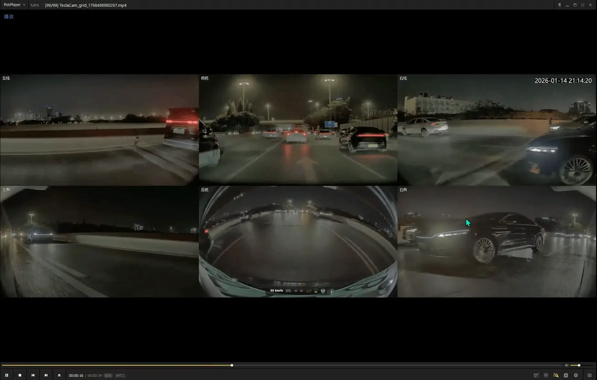 |

## ✨ Features


### 🎥 Video Playback
*   **Multi-Layout Sync**: Perfectly synchronized footage with multiple viewing modes: 6-grid full view, new 4-grid, old 4-grid, and single-camera full screen.
*   **B-Pillar Support**: Full coverage including Tesla's interior B-pillar cameras.
*   **Real-Time Dashboard**: Automatically parses SEI metadata to display speed, gear, steering angle, pedal status, Autopilot (AP/FSD) state, and GPS coordinates.
*   **Progress Bar Speed Curve**: Renders a real-time speed curve in the progress bar background, allowing you to quickly locate key moments like rapid acceleration or emergency braking.
*   **Driving Data Export**: One-click export of the complete driving metadata for the current event to a CSV file for further data analysis.
*   **Smart Filtering**: Easily filter recordings by date, time, and event type (Recent, Saved, Sentry).
*   **Map Integration**: View real-time street names and click to open the exact location on Google Maps or Gaode Maps.
*   **Interactive Controls**: Picture-in-Picture switching, 0.5x - 2.0x playback speed, instant clip download, and keyboard shortcuts (`Space` for play/pause).


> **Note:** Vehicle metadata is only available in videos recorded with **vehicle software version 2025.44.25.11 or later**.

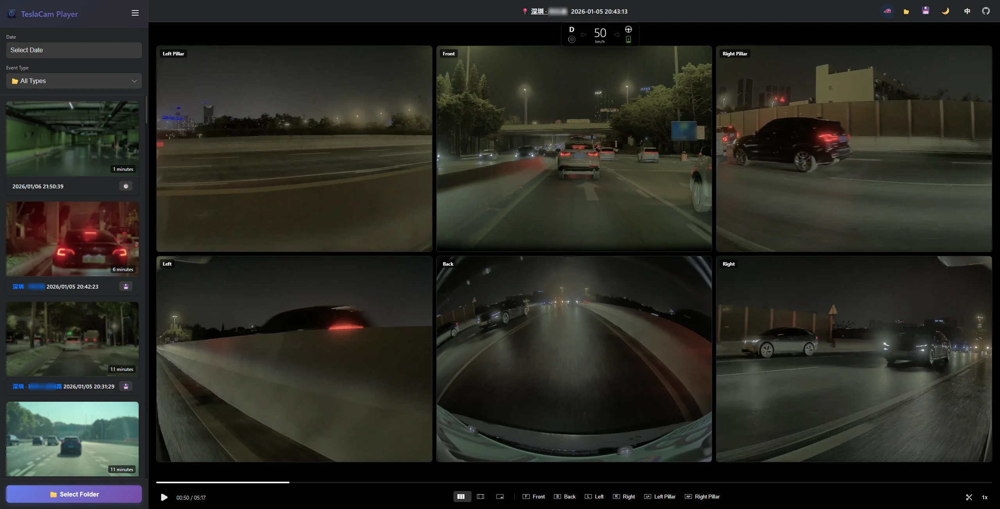
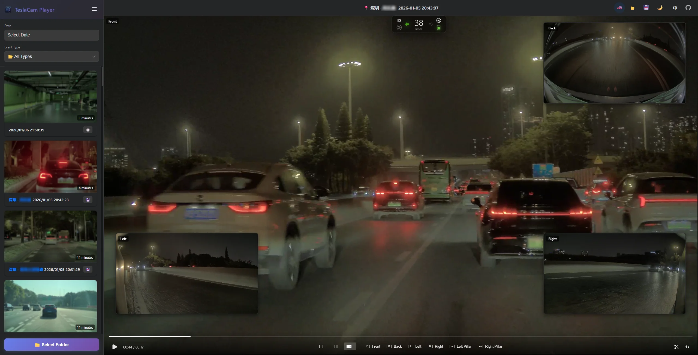

### ✂️ Video Clipping & Export

*   **Visual Precision Clipping**: Drag blue handles on the progress bar to select precise start and end points for your clip.
*   **Seamless Multi-Segment Merging**: Automatically handles clips that span across multiple 1-minute raw video files.
*   **One-Click Grid Export**: Combine selected camera views into a grid video (2x2 or 2x3) with enhanced, high-readability labels.
*   **Timestamp Watermarks**: Add real-time timestamp and driving information (speed, gear, AP status, etc.) overlays to your exported videos for comprehensive reference.
*   **Flexible Configuration**: Choose specific camera combinations to export and get real-time visual progress feedback.

### 🎨 Modern User Interface
*   **Dual-Theme Support**: Sleek Light and Dark modes with automatic system detection.
*   **Internationalization**: Full English and Chinese support, auto-detected from browser settings.
*   **Premium Design**: Modern card-based layout with smooth animations and a stylish purple gradient theme.
*   **Privacy & Performance**: 100% local processing in your browser (Canvas API & MediaRecorder). Your data never leaves your device.


## 🚀 How to Use

### 🖥️ Desktop Application (Recommended)

Download the desktop application for your platform from the [Releases](https://github.com/DeaglePC/TDashcamStudio/releases) page:

| Platform | Download |
|----------|----------|
| Windows | `.exe` / `.msi` |
| macOS (Apple Silicon) | `.dmg` (aarch64) |
| macOS (Intel) | `.dmg` (x64) |
| Linux | `.deb` / `.AppImage` |

> **Note for macOS Users:**
> If you encounter the "App is damaged and can't be opened" error, this is due to Apple's security quarantine. Please run the following command in Terminal to fix it:
> ```bash
> sudo xattr -rd com.apple.quarantine /Applications/TDashcam\ Studio.app
> ```
> *(Adjust the path if your app is not in the /Applications folder)*

**Advantages of Desktop App:**
- No need to start a local server
- Native file system access
- Better performance
- Works offline

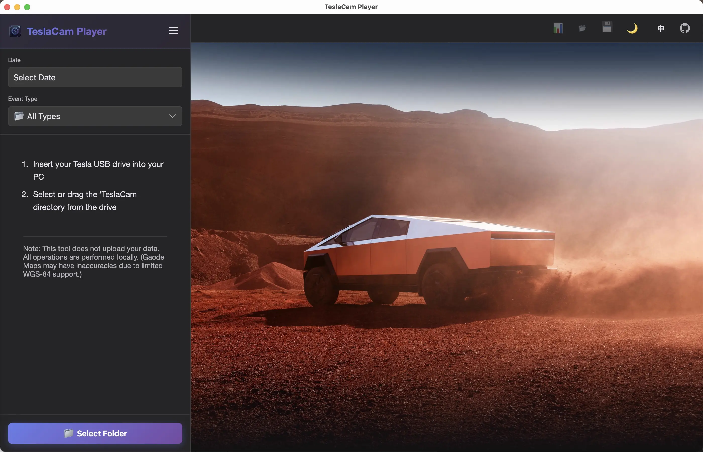

---

### 🌐 Online Version (Quickest Way)

You can directly use the online version without any installation:

**👉 [https://teslacam.dpc.cool/](https://teslacam.dpc.cool/)**

Simply visit the website and select your TeslaCam folder to start using it right away. All processing is done locally in your browser, ensuring your privacy.

---

### 💻 Local Deployment

Because of web browser security policies, you need to run this application from a local web server.

**1. Start the Local Server**

If you have Node.js installed, the easiest way is to use `npx`:

```bash
npx http-server -p 8188 src
```

Then, open your browser and go to `http://localhost:8188`.

**2. Deploy with Docker**

If you have Docker installed, you can easily run the application in a container.

**Option A: Using Docker Compose (Recommended)**

The easiest way is to use Docker Compose with the pre-built image:

1.  **Start the application:**
    ```bash
    docker compose up -d
    ```

2.  **Access the application:**
    Open your browser and go to `http://localhost:8188`.

3.  **Stop the application:**
    ```bash
    docker compose down
    ```

4.  **View logs:**
    ```bash
    docker compose logs -f
    ```

5.  **Update to latest version:**
    ```bash
    docker compose pull
    docker compose up -d
    ```

**Option B: Using Docker CLI**

1.  **Pull and run the pre-built image:**
    ```bash
    docker run -d -p 8188:80 --name tdashcam-studio dupengcheng66666/tdashcam-studio:latest
    ```

2.  **Or build your own image:**
    ```bash
    docker build -t tdashcam-studio .
    docker run -d -p 8188:80 tdashcam-studio
    ```

3.  **Access the application:**
    Open your browser and go to `http://localhost:8188`.

**3. Select Your TeslaCam Folder**

1.  Click the "📁 Select Folder" button.
2.  In the file selection dialog, navigate to and select the root `TeslaCam` folder from your USB drive.

**4. Browse and Play**

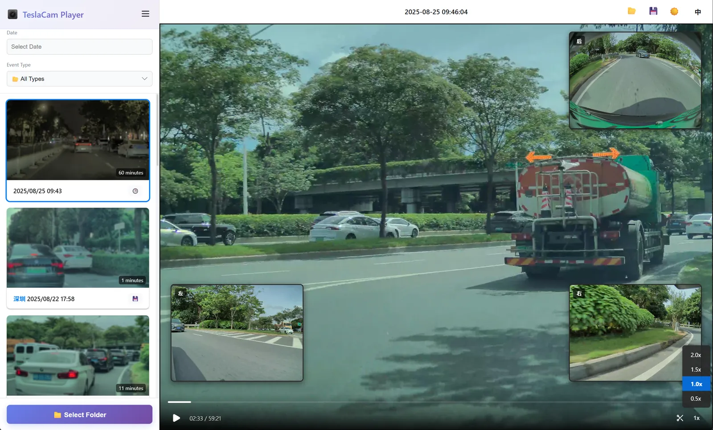

*   Your recordings will appear in the sidebar, sorted by date.
*   Use the filters to find specific events.
*   Click on any event to start playing.
*   Click on a city name (if available) to open the location on Gaode Map or Google Maps.
*   When paused, click the 💾 icon in the header to download the current video file.

**5. Clip and Export Videos**


1.  Click the **✂️ (scissors)** icon in the video controls to enter clip mode.
2.  **Drag the blue handles** on the progress bar to select the start and end points of your desired clip.
3.  Click the **✓ (checkmark)** icon to confirm your selection and open the export dialog.

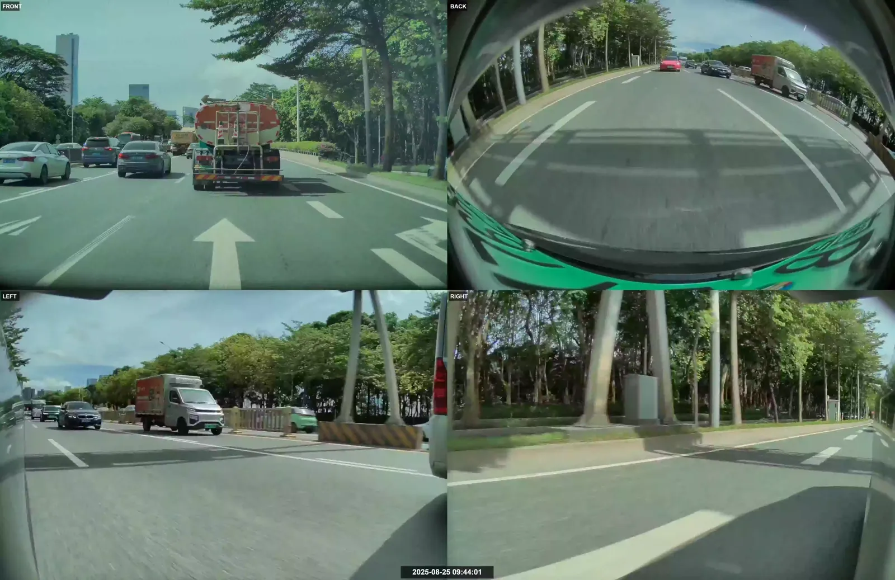

4.  **Configure export options**:
    - **Select Cameras**: Choose which camera angles to export (Front, Back, Left, Right, Left B-Pillar, Right B-Pillar, or any combination)
    - **Add Timestamp Watermark**: Overlay real-time timestamp showing the exact recording time
    - **Merge as Grid Video**: Combine all selected cameras into a grid view (2x2 or 2x3) with enhanced text visibility
5.  Click **"Start Export"** to process and download your clip(s).

**Key Features:**
- Automatically handles clips spanning multiple 1-minute video segments
- Maintains accurate timestamps across all segments
- Grid videos feature double-sized text (36px camera labels, 48px timestamps) for better readability
- All processing is done locally in your browser using Canvas API and MediaRecorder
- Exported videos are in WebM format with H.264 codec

*Note: For clips longer than 1 minute, the application automatically processes all required video segments and concatenates them seamlessly.*

## ⌨️ Keyboard Shortcuts

*   **`Spacebar`**: Play / Pause the video.

## 🔒 Privacy First

This tool is built with privacy as a top priority. **All file processing happens directly in your browser.** Your videos and data are never uploaded to any server. It's completely private and secure.

## 🛠️ Tech Stack

*   **HTML5, CSS3, JavaScript (ES6+)**
*   No frameworks, just pure vanilla JS for performance.
*   File System Access API for local file handling.
*   **Tauri** for desktop application (Rust backend + WebView).

## 📄 License

AGPL-3.0 License

